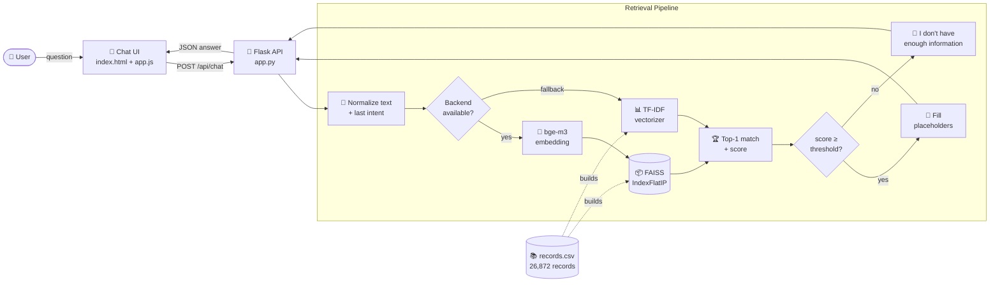
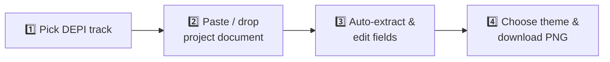

<div align="center">

# 🤖 RAG-Powered Customer Support Chatbot

**Semantic-search customer support assistant built with Flask, FAISS & Sentence-Transformers**

*+ a built-in DEPI Graduation Project Infographic Generator*

<p>
  
  
  
  
  
  
</p>

<p>
  
  
  
  
  
</p>

[Features](#-features) •
[Architecture](#-architecture) •
[Quick Start](#-quick-start) •
[API](#-api-reference) •
[Dataset](#-knowledge-base) •
[Deployment](#-deployment) •
[Docs](DOCUMENTATION.md)

</div>

---

## 📌 Overview

This project is a **Retrieval-Augmented customer support chatbot**. Instead of generating free text (which can hallucinate), it **retrieves** the most relevant verified answer from a knowledge base of **26,872 support conversations** using dense vector embeddings, then **personalizes** the answer by filling in dynamic placeholders such as order numbers, support hours, and contact details.

If the embedding model can't be loaded (no GPU, missing DLLs, low memory), the system **automatically falls back to TF-IDF** keyword retrieval, so the app always stays online.

> [!TIP]
> The project also ships with an **Infographic Generator** (`/infograph`) that turns any project document into a polished 1920×1080 presentation slide, entirely in the browser.

---

## ✨ Features

| | Feature | Description |
|:-:|---|---|
| 🧠 | **Semantic Search** | Dense embeddings from [`BAAI/bge-m3`](https://huggingface.co/BAAI/bge-m3) + FAISS inner-product index (cosine similarity) |
| 🛟 | **Automatic Fallback** | Switches to TF-IDF (1–2 n-grams) if `sentence-transformers` fails to load |
| 🔗 | **Context Awareness** | Remembers the last matched intent to improve answers to follow-up questions |
| 🧩 | **Smart Placeholders** | Replaces `{{Order Number}}`, `{{Customer Support Hours}}`, etc. with real or sensible values |
| 🎚️ | **Confidence Control** | Adjustable similarity threshold (0.20–0.90) directly from the chat UI |
| 🚫 | **Safe "I don't know"** | Returns a polite refusal when the best match is below the threshold, instead of guessing |
| 📦 | **Cached Index** | FAISS index + ID map are built once and reused on later startups |
| 📍 | **Order Tracking Page** | Lightweight `/track` page linked directly from bot answers |
| 🎨 | **Infographic Generator** | Client-side HTML5 Canvas slide builder with 10 DEPI tracks & 4 color themes |
| 🚀 | **Production Ready** | Gunicorn + `Procfile` + `runtime.txt` for one-click cloud deployment |

---

## 🏗️ Architecture



### 🔍 How a question is answered

1. **Normalize**: the question (plus the previous intent, if any) is cleaned, and `{{...}}` templates are collapsed to `[ENTITY]`.
2. **Embed**: `bge-m3` converts it into a normalized dense vector.
3. **Search**: FAISS finds the closest record by cosine similarity (inner product on unit vectors).
4. **Gate**: if the score is below the threshold, the bot declines instead of hallucinating.
5. **Personalize**: placeholders in the stored response are replaced (order number extracted from the question, company info, safe defaults).
6. **Respond**: returns `answer`, `score`, `matched_intent`, and the `backend` used.

---

## 🚀 Quick Start

### Prerequisites

| Requirement | Version |
|---|---|
| Python | 3.12.x |
| RAM | ≥ 4 GB (8 GB recommended) |
| Disk | ≥ 3 GB (embedding model + FAISS index) |

### Installation

```bash
# 1. Clone the repository
git clone https://github.com/seif630/RAG-powered-customer-support-chatbot.git
cd RAG-powered-customer-support-chatbot

# 2. Create & activate a virtual environment
python -m venv .venv
.venv\Scripts\activate          # Windows
# source .venv/bin/activate     # macOS / Linux

# 3. Install dependencies
pip install -r requirements.txt

# 4. Run the app
python app.py
```

> 💡 **Windows shortcut:** after creating `.venv`, just double-click **`Run Project.bat`**. It activates the environment, starts the server and opens your browser.

---

## 📡 API Reference

### `POST /api/chat`

| Field | Type | Required | Description |
|---|---|:-:|---|
| `message` | `string` | ✅ | The user's question |
| `threshold` | `float` | ❌ | Minimum similarity score (default `0.45`) |
| `last_intent` | `string` | ❌ | Previously matched intent, for follow-up context |

**Request**

```bash
curl -X POST http://localhost:5000/api/chat \
  -H "Content-Type: application/json" \
  -d '{"message": "I want to cancel order 45821", "threshold": 0.45}'
```

**Response**

```json
{
  "answer": "I've understood you want to cancel order 45821. Here's how to proceed...",
  "score": 0.8742,
  "matched_intent": "cancel_order",
  "backend": "sentence-transformers"
}
```

| Status | Meaning |
|---|---|
| `200` | Answer returned (or a polite refusal if `matched_intent` is `null`) |
| `400` | `message` is missing or empty |

---

## 📚 Knowledge Base

`records.csv` contains **26,872** customer-support examples across **11 categories** and **27 intents**:

| Category | Intents |
|---|---|
| 👤 **ACCOUNT** | `create_account` · `delete_account` · `edit_account` · `recover_password` · `registration_problems` · `switch_account` |
| 📦 **ORDER** | `cancel_order` · `change_order` · `place_order` · `track_order` |
| 💸 **REFUND** | `check_refund_policy` · `get_refund` · `track_refund` |
| 💳 **PAYMENT** | `check_payment_methods` · `payment_issue` |
| 🚚 **DELIVERY** | `delivery_options` · `delivery_period` |
| 🏠 **SHIPPING** | `change_shipping_address` · `set_up_shipping_address` |
| 🧾 **INVOICE** | `check_invoice` · `get_invoice` |
| 📞 **CONTACT** | `contact_customer_service` · `contact_human_agent` |
| ⭐ **FEEDBACK** | `complaint` · `review` |
| ❌ **CANCEL** | `check_cancellation_fee` |
| 📰 **SUBSCRIPTION** | `newsletter_subscription` |

**Schema:** `id` · `flags` · `category` · `intent` · `composite_text` · `response`

> To customize the bot for your business, edit `records.csv` and the `COMPANY_INFO` dictionary in `app.py`, then delete `vector_index.faiss` and `id_map.json` so the index is rebuilt.

---

## ⚙️ Configuration

All settings live at the top of [`app.py`](app.py):

| Setting | Default | Description |
|---|---|---|
| `DEFAULT_THRESHOLD` | `0.45` | Minimum similarity to accept a match (TF-IDF caps it at `0.12`) |
| `TOP_K` | `1` | Number of nearest neighbours retrieved |
| `COMPANY_INFO` | *dict* | Support hours, phone number, website, order-tracking link… |
| Embedding model | `BAAI/bge-m3` | Set in `load_or_build()` |

---

## 🗂️ Project Structure

```
RAG-powered-customer-support-chatbot/
├── app.py                       # Flask app + RAG pipeline + placeholder engine
├── records.csv                  # Knowledge base (26,872 intents & responses)
├── notbook.ipynb                # Data exploration & preprocessing notebook
├── requirements.txt             # Python dependencies
├── Procfile                     # gunicorn app:app
├── runtime.txt                  # python-3.12.4
├── Run Project.bat              # One-click launcher (Windows)
├── DOCUMENTATION.md             # Full technical documentation
├── support_chatbot_rag_infographic.pptx
├── templates/
│   ├── index.html               # Chatbot UI
│   ├── track.html               # Order-tracking page
│   └── infograph.html           # Infographic Generator
├── static/
│   ├── style.css · app.js                 # Chatbot frontend
│   └── infograph.css · infograph.js       # Infographic frontend
└── saved_t5_model/              # T5 config & tokenizer (weights not included, 3 GB)
```

*Generated at runtime (git-ignored): `vector_index.faiss`, `id_map.json`*

---

## 🎨 Infographic Generator

Create a **premium 16:9 slide (1920×1080 PNG)** for a DEPI graduation project in 4 steps, with no external API needed:



- **10 tracks**: AI & Data Science, Data Engineering, Full Stack .NET/Python, Front-End, DevOps, Cloud, Cybersecurity, Embedded, Mobile
- **Smart parser** extracts title, problem, solution, features, and 50+ technologies automatically
- **4 themes**: Blue · Teal · Violet · Orange
- Works with PowerPoint, Google Slides and Keynote

---

## 🚢 Deployment

The repo is ready for **Render**, **Heroku** or **Railway**: `Procfile` and `runtime.txt` are already configured.

```bash
gunicorn app:app --workers 2 --bind 0.0.0.0:5000 --preload
```

> [!IMPORTANT]
> `vector_index.faiss` (~105 MB) is **not committed** because it exceeds GitHub's file limit. It is rebuilt automatically on first startup. On hosts with ephemeral disks, use persistent storage to avoid rebuilding on every deploy.

---

## 🛠️ Troubleshooting

<details>
<summary><b>Every answer is "I don't have enough information"</b></summary>

Lower the **Confidence** slider in the UI (try `0.30`), or check the `backend` field in the API response. If it says `tfidf`, the embedding model failed to load.
</details>

<details>
<summary><b><code>sentence_transformers</code> / <code>torch</code> fails to load on Windows</b></summary>

The app automatically falls back to TF-IDF. To restore semantic search, install the [Microsoft Visual C++ Redistributable](https://learn.microsoft.com/cpp/windows/latest-supported-vc-redist) and reinstall `torch`.
</details>

<details>
<summary><b>Answers are outdated after editing <code>records.csv</code></b></summary>

Delete `vector_index.faiss` and `id_map.json`, then restart the app to rebuild the index.
</details>

More in the [full documentation](DOCUMENTATION.md#12-troubleshooting).

---

## 🗺️ Roadmap

- [ ] Generative answers with an LLM on top of retrieved context (full RAG)
- [ ] Top-K re-ranking with a cross-encoder
- [ ] Multi-language support (bge-m3 is already multilingual)
- [ ] Docker image
- [ ] Conversation history & analytics dashboard

---

## 👤 Author

**Seif** · [@seif630](https://github.com/seif630)

Built as a graduation project for the **Digital Egypt Pioneers Initiative (DEPI) — Round 4**.

<div align="center">

⭐ **If you found this project useful, give it a star!** ⭐

</div>
